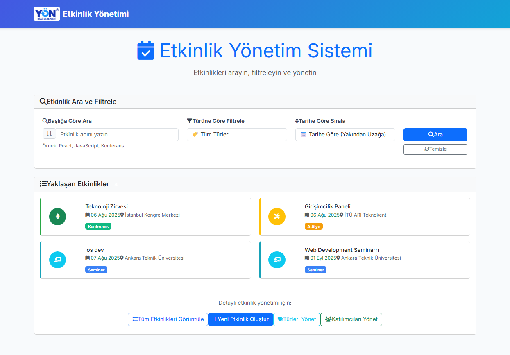

# 🎉 EventManagment  
**Etkinlik ve Katılımcı Yönetim Uygulaması (.NET MVC)**  
Bu projede, kurumsal veya sosyal etkinliklerin yönetilebildiği küçük ölçekli bir web uygulaması geliştirdim.
Kullanıcılar, sistem üzerinden yeni etkinlikler oluşturabiliyor; bu etkinliklere katılımcılar ekleyebiliyor ve ayrıca etkinlikleri listeleyip filtreleyebiliyorlar.
Ayrıca mevcut etkinlikler üzerinde düzenleme işlemleri de yapılabiliyor.
Proje, etkinlik ve katılımcı yönetimini pratik hale getirmek amacıyla tasarlanmıştır.

## 📦 Görsel İçerik



## 🎬 Uygulama Demo


## 📦 Proje İçeriği  

#### 1. Etkinlik Oluşturma  
- Ana sayfadan **"Yeni Etkinlik Oluştur"** butonuna tıklayın  
- Gerekli bilgileri doldurun (başlık, açıklama, tarih, konum)  
- Etkinlik türünü seçin  
- **"Kaydet"** butonuna tıklayın  

#### 2. Katılımcı Ekleme  
- **"Katılımcıları Yönet"** sayfasına gidin  
- **"Yeni Katılımcı Ekle"** butonuna tıklayın  
- Kişisel bilgileri girin  
- Katılımcıyı kaydedin

#### 3. Arama ve Filtreleme
- Etkinlikler,**başlığa göre** aranabilir.
- Etkinlik **türüne göre filtreleme** yapılabilir.
- Etkinlikler **tarihe göre** sıralanabilir.

#### 4. Etkinliğe Katılımcı Ekleme  
- Katılımcı listesinde kişinin yanındaki **"+"** butonuna tıklayın  
- Modal'da görünen etkinliklerden istediğinizi seçin  
- **"Seçili Etkinliklere Ekle"** butonuna tıklayın  

## Kullanılan Teknolojiler
- Backend : .NET Framework (4.8) 
- Frontend : ASP.NET MVC + Razor Pages 
- Veritabanı : Microsoft SQL Server 
- ORM : Entity Framework
- Logging : Serilog
- Versiyon : Git + GitHub 

---

## 🚀 Kurulum  
### Adım Adım Kurulum  
```bash
# 1. Projeyi klonlayın
git clone https://github.com/seymatttass/EventsManagementApp.git
cd EventManagment

# 2. NuGet paketlerini yükleyin
Update-Package -reinstall  

# 3. Veritabanını oluşturun (Package Manager Console'da)
- Migration'ı aktifleştir
  Enable-Migrations

- İlk migration'ı oluştur
  Add-Migration InitialCreate

- Veritabanına uygula
  Update-Database

# 4. Projeyi çalıştırın
Visual Studio'da F5 tuşuna basın  
# Tarayıcıda https://localhost:44328 adresine gidin  
```


## Proje Yapısı
```bash
EventManagementApp/
├── 📁 Data/
│   ├── Entities/   
│   ├── Context/           # Entity Framework DbContext
│   ├── Repositories/      # Repository implementasyonları
│   └── Migrations/        # Veritabanı migration'ları
│   └── Interfaces/        # Repository interface
├── 📁 Business/
│   ├── Services/          # Business logic
│   └── Interfaces/        # Service interface
├── 📁 Web/
│   ├── Controllers/       # MVC Controller'lar
│   ├── Views/             # Razor View'lar
│   ├── Scripts/           # JavaScript dosyaları
│   ├── Content/           # CSS dosyaları
│   └── App_Start/         # Konfigürasyon dosyaları
└── 📄 README.md
```


## 📞 **İletişim**
- Email: seyyyma08@gmail.com
- LinkedIn: https://www.linkedin.com/in/%C5%9Feyma-ta%C5%9F-642600272/
- Project Link: https://github.com/seymatttass/EventsManagementApp
